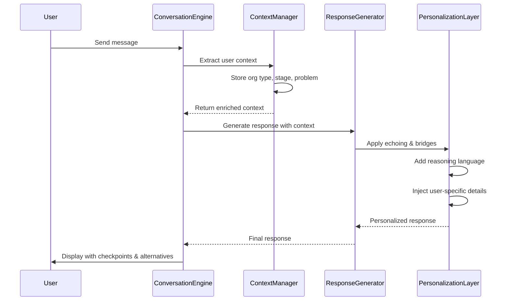
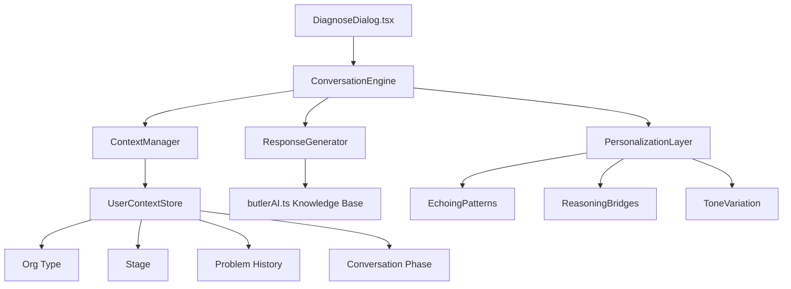

# Design Document: Butler AI Conversational Intelligence Enhancement

## Overview

This design enhances Butler AI's conversational intelligence to make the scripted mimic prototype feel more natural and intelligent. The enhancement focuses on 10 critical improvements that add conversational sophistication without requiring external AI APIs. The goal is to transform the current pattern-based response system into a conversation that feels personalized, thoughtful, and adaptive while maintaining the existing architecture (DiagnoseDialog.tsx for flow, butlerAI.ts for knowledge).

## Main Algorithm/Workflow



## Architecture

The enhancement adds three new layers to the existing Butler AI architecture:



## Components and Interfaces

### Component 1: ConversationEngine

**Purpose**: Orchestrates the conversation flow with enhanced intelligence patterns

**Interface**:

```typescript
interface ConversationEngine {
  processMessage(message: string, context: UserContext): ConversationResponse;
  applyConversationalPatterns(response: BaseResponse): EnhancedResponse;
  determineConversationPhase(): ConversationPhase;
}

interface ConversationResponse {
  content: string;
  options: string[];
  links?: Link[];
  metadata: ResponseMetadata;
  checkpoints?: Checkpoint[];
  alternatives?: Alternative[];
}

type ConversationPhase = "greeting" | "discovery" | "advisory" | "guidance" | "closure";
```

**Responsibilities**:

- Coordinate between context management and response generation
- Apply conversational intelligence patterns (echoing, bridges, progression)
- Manage conversation phase transitions
- Inject checkpoints and alternatives

### Component 2: ContextManager

**Purpose**: Tracks and enriches user context throughout the conversation

**Interface**:

```typescript
interface ContextManager {
  extractContext(message: string): ExtractedContext;
  updateContext(context: Partial<UserContext>): void;
  getEnrichedContext(): UserContext;
  getConversationHistory(): Message[];
}

interface UserContext {
  organizationType?: "enterprise" | "smb" | "startup";
  transformationStage?: "starting" | "underway" | "optimizing";
  industry?: string;
  challenges: string[];
  mentionedTopics: string[];
  conversationPhase: ConversationPhase;
  turnCount: number;
}

interface ExtractedContext {
  entities: string[];
  topics: string[];
  sentiment: "positive" | "neutral" | "uncertain";
}
```

**Responsibilities**:

- Extract entities and topics from user messages
- Maintain conversation state and history
- Provide enriched context for personalization
- Track conversation progression

### Component 3: PersonalizationLayer

**Purpose**: Applies conversational sophistication patterns to responses

**Interface**:

```typescript
interface PersonalizationLayer {
  applyEchoing(response: string, context: UserContext): string;
  addReasoningBridge(response: string, context: UserContext): string;
  injectUserDetails(response: string, context: UserContext): string;
  adjustTone(response: string, phase: ConversationPhase): string;
  addCheckpoint(response: ConversationResponse): ConversationResponse;
  generateAlternatives(primary: string, context: UserContext): Alternative[];
}

interface Alternative {
  label: string;
  description: string;
  action: string;
}

interface Checkpoint {
  type: "confirmation" | "clarification" | "option-check";
  question: string;
  options: string[];
}
```

**Responsibilities**:

- Apply conversational echoing patterns
- Insert reasoning bridges before recommendations
- Inject personalized details from context
- Vary tone based on conversation phase
- Add micro-recovery checkpoints
- Generate alternative options

### Component 4: ResponseGenerator

**Purpose**: Generates base responses with step-by-step progression

**Interface**:

```typescript
interface ResponseGenerator {
  generateResponse(intent: string, context: UserContext): BaseResponse;
  breakIntoSteps(response: string): ResponseSteps;
  addGuidedChoices(response: BaseResponse): BaseResponse;
}

interface BaseResponse {
  acknowledge: string;
  clarify?: string;
  recommend: string;
  metadata: ResponseMetadata;
}

interface ResponseSteps {
  step1_acknowledge: string;
  step2_clarify?: string;
  step3_recommend: string;
}
```

**Responsibilities**:

- Generate structured responses (acknowledge → clarify → recommend)
- Break responses into progressive steps
- Add guided next actions
- Integrate with knowledge base

## Data Models

### Model 1: UserContext

```typescript
interface UserContext {
  // Profile Information
  organizationType?: "enterprise" | "smb" | "startup" | "government";
  transformationStage?: "starting" | "underway" | "optimizing";
  industry?: string;

  // Conversation State
  challenges: string[];
  mentionedTopics: string[];
  conversationPhase: ConversationPhase;
  turnCount: number;

  // Extracted Entities
  extractedEntities: {
    problems: string[];
    goals: string[];
    constraints: string[];
    preferences: string[];
  };

  // Conversation History
  lastUserMessage: string;
  lastAIResponse: string;
  conversationStartTime: number;
}
```

**Validation Rules**:

- organizationType must be one of the defined enum values
- challenges array must not exceed 10 items
- turnCount must be non-negative integer
- conversationPhase must progress logically (greeting → discovery → advisory → guidance)

### Model 2: ConversationResponse

```typescript
interface ConversationResponse {
  // Core Content
  content: string;

  // Interactive Elements
  options: string[];
  links?: Link[];

  // Metadata
  metadata: {
    stage: "concierge" | "advisory";
    intent: string;
    confidence: number;
    tower?: string;
    service?: string;
    conversationPhase: ConversationPhase;
  };

  // Intelligence Features
  checkpoints?: Checkpoint[];
  alternatives?: Alternative[];
  reasoning?: string;
}

interface Link {
  text: string;
  url: string;
  icon?: string;
}

interface Checkpoint {
  type: "confirmation" | "clarification" | "option-check";
  question: string;
  options: string[];
}

interface Alternative {
  label: string;
  description: string;
  action: string;
  confidence?: number;
}
```

**Validation Rules**:

- content must not be empty
- options array must contain 2-5 items
- confidence must be between 0-100
- checkpoints should appear every 2-3 turns
- alternatives must provide at least 2 options

### Model 3: ConversationalPattern

```typescript
interface ConversationalPattern {
  // Echoing Patterns
  echoing: {
    templates: string[];
    frequency: "always" | "often" | "sometimes";
    applicablePhases: ConversationPhase[];
  };

  // Reasoning Bridges
  reasoningBridges: {
    templates: string[];
    triggers: string[];
    applicableIntents: string[];
  };

  // Tone Variations
  toneVariations: {
    [phase in ConversationPhase]: {
      style: string;
      vocabulary: string[];
      sentenceStructure: string;
    };
  };

  // Soft Confidence Language
  softLanguage: {
    qualifiers: string[];
    hedges: string[];
    suggestions: string[];
  };
}
```

**Validation Rules**:

- Each pattern must have at least 3 template variations
- Tone variations must be defined for all conversation phases
- Soft language qualifiers must be contextually appropriate
